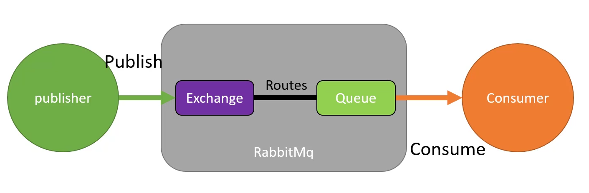
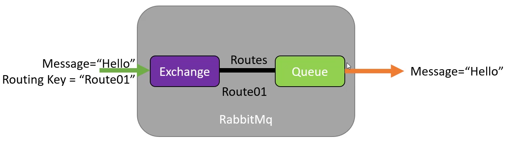
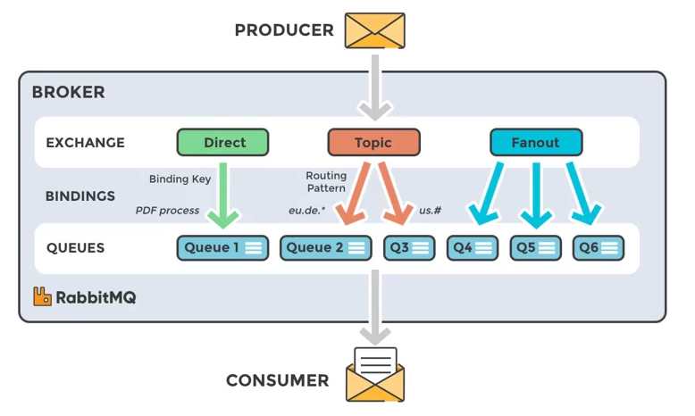
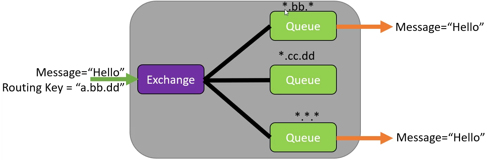
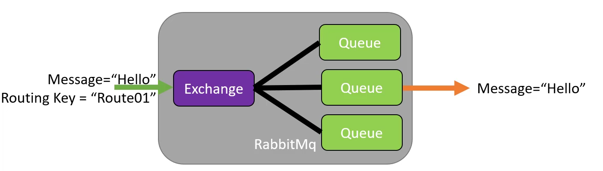
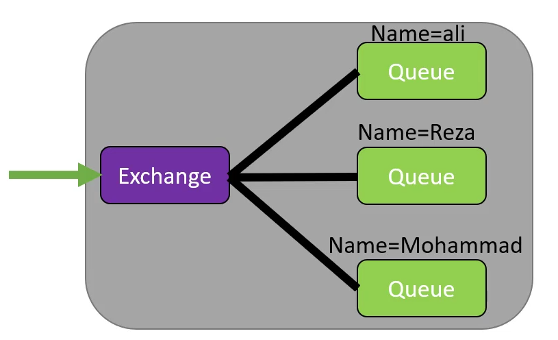

# RabbitMQ

## Direct

Send message to a special queue

Binding Key = Route Key

## Default

Send message to a queue with a unique name.

## Topic

Send message to all queues by special pattern. (The name of the queue doesn`t matter)

Recommended for Pub/Sub scenarios.

## Fanout

Send message to all queues - recommended for broadcasting

## Header

Send message to queue by matching headers

Should add `x-match` to `Binding`.

`any`, `all`

